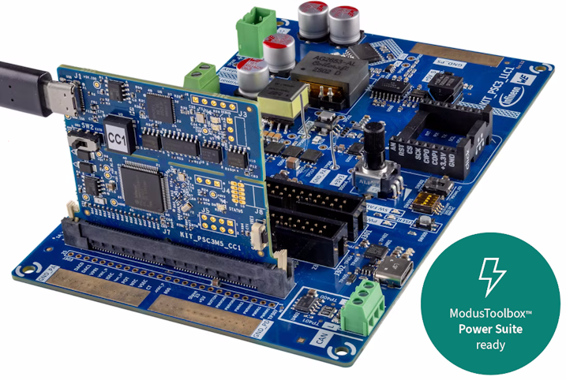

# ModusToolbox&trade; Power Suite Full-Bridge LLC Reference Code Example

This code example demonstrates how to use the ModusToolbox&trade; Power Suite LLC Middleware to build the LLC power converter.

> **Note:** This code example involves control of the power conversion circuit. Follow all safety precautions described in the kit user guide. This code example is intended for demonstration and learning purposes only, and is not designed for industrial use.

[View this README on GitHub.](https://github.com/Infineon/mtb-example-pwrlib-llc)

## Requirements

- [ModusToolbox&trade;](https://www.infineon.com/modustoolbox) v3.8.0 or later (tested with v3.8.0)
- [ModusToolbox&trade; Power Suite GUI](https://softwaretools.infineon.com/tools/com.ifx.tb.tool.modustoolboxpowersuite) v1.1.0
- Board support package (BSP) minimum required version: 3.2.0
- Programming language: C
- Associated parts: [PSOC&trade; Control series](https://www.infineon.com/products/microcontroller/32-bit-psoc-arm-cortex/32-bit-psoc-control-arm-cortex-m33-mcu/psoc-control-c3-main-line)


## Supported toolchains (make variable 'TOOLCHAIN')

- GNU Arm&reg; Embedded Compiler v14.2.1 (`GCC_ARM`) – Default value of `TOOLCHAIN`


## Supported kits (make variable 'TARGET')

- [PSOC&trade; Control C3M5 Digital Power Control Card](https://www.infineon.com/evaluation-board/KIT-PSC3M5-CC1) (`KIT-PSC3M5-CC1`) – Default value of `TARGET` + [Low Voltage LLC Power Board](https://www.infineon.com/evaluation-board/KIT_PSC3_LLC1) (`KIT_PSC3_LLC1`)



## Hardware setup

This example uses the board's default configuration. See the kit user guide to ensure that the board is configured correctly.


## Software setup

See the [ModusToolbox&trade; tools package installation guide](https://www.infineon.com/ModusToolboxInstallguide) for information about installing and configuring the tools package.

The [ModusToolbox&trade; Power Suite GUI](https://softwaretools.infineon.com/tools/com.ifx.tb.tool.modustoolboxpowersuite) is usually being installed separately


## Using the code example


### Create the project

The ModusToolbox&trade; tools package provides the Project Creator as both a GUI tool and a command line tool.

<details><summary><b>Use Project Creator GUI</b></summary>

1. Open the Project Creator GUI tool

   There are several ways to do this, including launching it from the dashboard or from inside the Eclipse IDE. For more details, see the [Project Creator user guide](https://www.infineon.com/ModusToolboxProjectCreator) (locally available at *{ModusToolbox&trade; install directory}/tools_{version}/project-creator/docs/project-creator.pdf*)

2. On the **Choose Board Support Package (BSP)** page, select a kit supported by this code example. See [Supported kits](#supported-kits-make-variable-target)

   > **Note:** To use this code example for a kit not listed here, you may need to update the source files. If the kit does not have the required resources, the application may not work

3. On the **Select Application** page:

   a. Select the **Applications(s) Root Path** and the **Target IDE**

      > **Note:** Depending on how you open the Project Creator tool, these fields may be pre-selected for you

   b. Select this code example from the list by enabling its check box

      > **Note:** You can narrow the list of displayed examples by typing in the filter box

   c. (Optional) Change the suggested **New Application Name** and **New BSP Name**

   d. Click **Create** to complete the application creation process

</details>


<details><summary><b>Use Project Creator CLI</b></summary>

The 'project-creator-cli' tool can be used to create applications from a CLI terminal or from within batch files or shell scripts. This tool is available in the *{ModusToolbox&trade; install directory}/tools_{version}/project-creator/* directory.

Use a CLI terminal to invoke the 'project-creator-cli' tool. On Windows, use the command-line 'modus-shell' program provided in the ModusToolbox&trade; installation instead of a standard Windows command-line application. This shell provides access to all ModusToolbox&trade; tools. You can access it by typing "modus-shell" in the search box in the Windows menu. In Linux and macOS, you can use any terminal application.

The following example clones the "[mtb-example-pwrlib-llc](https://github.com/Infineon/mtb-example-pwrlib-llc)" application with the desired name "MyLlcApp" configured for the *KIT-PSC3M5-CC1* BSP into the specified working directory, *C:/mtb_projects*:

   ```
   project-creator-cli --board-id KIT-PSC3M5-CC1 --app-id mtb-example-pwrlib-llc --user-app-name MyLlcApp --target-dir "C:/mtb_projects"
   ```

The 'project-creator-cli' tool has the following arguments:

Argument | Description | Required/optional
---------|-------------|-----------
`--board-id` | Defined in the <id> field of the [BSP](https://github.com/Infineon?q=bsp-manifest&type=&language=&sort=) manifest | Required
`--app-id`   | Defined in the <id> field of the [CE](https://github.com/Infineon?q=ce-manifest&type=&language=&sort=) manifest | Required
`--target-dir`| Specify the directory in which the application is to be created if you prefer not to use the default current working directory | Optional
`--user-app-name`| Specify the name of the application if you prefer to have a name other than the example's default name | Optional

<br>

> **Note:** The project-creator-cli tool uses the `git clone` and `make getlibs` commands to fetch the repository and import the required libraries. For details, see the "Project creator tools" section of the [ModusToolbox&trade; tools package user guide](https://www.infineon.com/ModusToolboxUserGuide) (locally available at {ModusToolbox&trade; install directory}/docs_{version}/mtb_user_guide.pdf).

</details>


### Open the project

After the project has been created, you can open it in your preferred development environment.


<details><summary><b>Eclipse IDE</b></summary>

If you opened the Project Creator tool from the included Eclipse IDE, the project will open in Eclipse automatically.

For more details, see the [Eclipse IDE for ModusToolbox&trade; user guide](https://www.infineon.com/MTBEclipseIDEUserGuide) (locally available at *{ModusToolbox&trade; install directory}/docs_{version}/mt_ide_user_guide.pdf*).

</details>


<details><summary><b>Visual Studio (VS) Code</b></summary>

Launch VS Code manually, and then open the generated *{project-name}.code-workspace* file located in the project directory.

For more details, see the [Visual Studio Code for ModusToolbox&trade; user guide](https://www.infineon.com/MTBVSCodeUserGuide) (locally available at *{ModusToolbox&trade; install directory}/docs_{version}/mt_vscode_user_guide.pdf*).

</details>


<details><summary><b>Command line</b></summary>

If you prefer to use the CLI, open the appropriate terminal, and navigate to the project directory. On Windows, use the command-line 'modus-shell' program; on Linux and macOS, you can use any terminal application. From there, you can run various `make` commands.

For more details, see the [ModusToolbox&trade; tools package user guide](https://www.infineon.com/ModusToolboxUserGuide) (locally available at *{ModusToolbox&trade; install directory}/docs_{version}/mtb_user_guide.pdf*).

</details>


## Operation

1. Connect the board to your PC using the provided USB cable through the on-board JLink USB connector

2. Program the board using one of the following:

   <details><summary><b>Using Eclipse IDE</b></summary>

      1. Select the application project in the Project Explorer

      2. In the **Quick Panel**, scroll down, and click **\<Application Name> Program (JLink)**
   </details>


   <details><summary><b>In other IDEs</b></summary>

   Follow the instructions in your preferred IDE.

   </details>


   <details><summary><b>Using CLI</b></summary>

     From the terminal, execute the `make program` command to build and program the application using the default toolchain to the default target. The default toolchain is specified in the application's Makefile but you can override this value manually:
      ```
      make program TOOLCHAIN=<toolchain>
      ```

      Example:
      ```
      make program TOOLCHAIN=GCC_ARM
      ```
   </details>

3. After programming, the application starts automatically

### Monitor/control using Power Suite GUI

* Connect either the USB0010 or USB008 device to the PC using USB cable, and to the Control Card using 3 wires (GND, CLK, and SDA)
* Launch the Power Suite GUI from the ModusToolbox&trade; Quick Panel -> Tools
* Click the 'PMB' button at the top, it will show PMBus commands
* Click the 'OPERATION' command and click Loop [B] radio button
* VOUT_COMMAND write e.g. 4.5 (slightly different from the initial/default voltage)
* ON_OFF_CONFIG write 0x9 and observe the app switched to PMBus control: there are 4.5V at LLC output (the VOUT_COMMAND value)

<b>Note:</b> Use READ_VOUT/READ_IOUT command to refresh the Vout/Iout values
* To on/off the LLC operation write OPERATION 0x80/0x00 correspondingly

<b>Note:</b> OPERATION=0x00 (off) will work with any ON_OFF_CONFIG value, but OPERATION=0x80 (on) will work only with ON_OFF_CONFIG=0x9 (PMBus control)
* ON_OFF_CONFIG write 0x1 and observe the app switched to internal control: there is initial/default voltage at LLC output

## Debugging

You can debug the example to step through the code.

> **Note:** The LLC control loops cannot be step-by-step debugged on the fly with active live power conversion – this is a real-time process.

<details><summary><b>In Eclipse IDE</b></summary>

Use the **\<Application Name> Debug (JLink)** configuration in the **Quick Panel**. For details, see the "Program and debug" section in the [Eclipse IDE for ModusToolbox&trade; user guide](https://www.infineon.com/MTBEclipseIDEUserGuide).

</details>


<details><summary><b>In other IDEs</b></summary>

Follow the instructions in your preferred IDE.

</details>


## Design and implementation

This code example implements a Full-Bridge LLC power converter using the ModusToolbox&trade; Power Suite LLC Middleware. The application configures the PSOC&trade; Control C3 MCU to drive the LLC topology with closed-loop voltage regulation.

### Resources and settings

**Table 1. Application resources**

 Resource  |  Alias/object     |    Purpose
 :-------- | :-------------    | :------------
 TCPWM (HRPWM) | LLC_DRV0 | Primary half-bridge driver 0 (center-aligned, dead-time)
 TCPWM (HRPWM) | LLC_DRV1 | Primary half-bridge driver 1 (center-asymmetric, dead-time)
 TCPWM (HRPWM) | LLC_SR | Synchronous rectifier PWM driver (center-asymmetric, dead-time)
 TCPWM (PWM) | LLC_BRST | Burst mode modulator (center-aligned)
 TCPWM (Timer) | LLC_ISR0 | Fast control loop ISR timer
 TCPWM (Timer) | LLC_ISR1 | Slow control loop ISR timer
 TCPWM (Timer) | EXE_TIMER | Execution profiling timer
 HPPASS SAR ADC | LLC_VOUT | Output voltage sensing (ch[5])
 HPPASS SAR ADC | LLC_IOUT | Output current sensing (ch[12])
 HPPASS SAR ADC | LLC_VIN | Input voltage sensing (ch[16])
 HPPASS SAR ADC | LLC_NTC | NTC temperature sensing (ch[7])
 HPPASS SAR ADC | LLC_POT | Potentiometer input (ch[6])
 HPPASS SAR Filter | LLC_IOUT_FLT | FIR low-pass filter on output current
 HPPASS SAR Limit | LLC_VOUT_OV | Output overvoltage limit detector
 HPPASS SAR Limit | LLC_VIN_OV | Input overvoltage limit detector
 HPPASS CSG | LLC_IRES_OC | Resonant current overcurrent comparator (DAC-based)
 HPPASS CSG | LLC_IOUT_OC | Output current overcurrent comparator (DAC-based)
 HPPASS Trigger | LLC_PROT_TRG | Hardware protection trigger (kills PWMs on fault)
 HPPASS Trigger | LLC_FREQ_TRIG | ADC trigger synchronized to switching frequency
 SCB (I2C) | PMBUS_I2C | PMBus I2C slave interface (address 0x58, 100 kHz)
 SCB (UART) | DEBUG_UART | Debug UART via retarget-io (115200 baud, 8N1)
 GPIO | LLC_DRV0_H, LLC_DRV0_L | Half-bridge driver 0 high-side/low-side gate outputs
 GPIO | LLC_DRV1_H, LLC_DRV1_L | Half-bridge driver 1 high-side/low-side gate outputs
 GPIO | LLC_SR_A, LLC_SR_B | Synchronous rectifier gate outputs
 GPIO | LLC_FAULT_LED | Fault indicator LED
 GPIO | LLC_ACT_LED | Active/running indicator LED
 GPIO | CYBSP_USER_LED / HRT_BT_LED | Heartbeat LED
 GPIO | N_LLC_USER_BTN | User button input
 EEPROM | Emulated EEPROM | Parameter storage (4096 bytes)
 System clock | DPLL250[0], DPLL250[1] | 180 MHz (CPU), 240 MHz (HRPWM)

<br>

### Library Dependencies

The reference code example uses the following libraries:

* [mtb-pwrlib-llc](https://github.com/Infineon/mtb-pwrlib-llc) — Power Suite LLC Middleware
* [mtb-pmbus](https://github.com/Infineon/mtb-pmbus) — PMBus communication protocol
* [mtb-oscilloscope](https://github.com/Infineon/mtb-oscilloscope) — Lightweight software oscilloscope middleware
* [emeeprom](https://github.com/Infineon/emeeprom) — Emulated EEPROM for parameter storage
* [retarget-io](https://github.com/Infineon/retarget-io) — UART-based printf debug output


## Related resources

Resources  | Links
-----------|----------------------------------
Application notes  | [AN238329](https://www.infineon.com/assets/row/public/documents/30/42/infineon-an238329-getting-started-psoc-control-c3-modustoolbox-applicationnotes-en.pdf) – Getting started with PSOC&trade; Control MCU on ModusToolbox&trade;
Code examples  | [Using ModusToolbox&trade;](https://github.com/Infineon/Code-Examples-for-ModusToolbox-Software) on GitHub
Device documentation | [PSOC&trade; Control datasheet](https://www.infineon.com/assets/row/public/documents/30/49/infineon-psoc-control-c3-mainline-psc3p5xd-psc3m5xd-datasheet-datasheet-en.pdf)
Development kits | Select your kits from the [Evaluation board finder](https://www.infineon.com/cms/en/design-support/finder-selection-tools/product-finder/evaluation-board)
Libraries on GitHub  | [mtb-hal-psc3](https://github.com/Infineon/mtb-hal-psc3) - Hardware Abstraction Layer (HAL) library <br> [mtb-pdl-cat1](https://github.com/Infineon/mtb-pdl-cat1) - Peripheral Driver Library (PDL) <br> [core-lib](https://github.com/Infineon/core-lib - Fundamental types and utilities <br>
Tools  | [ModusToolbox&trade;](https://www.infineon.com/modustoolbox) - ModusToolbox&trade; software is a collection of easy-to-use libraries and tools enabling rapid development with Infineon MCUs for applications ranging from wireless and cloud-connected systems, edge AI/ML, embedded sense and control, to wired USB connectivity using PSOC&trade; Industrial/IoT MCUs, AIROC&trade; Wi-Fi and Bluetooth&reg; connectivity devices, XMC&trade; Industrial MCUs, and EZ-USB&trade;/EZ-PD&trade; wired connectivity controllers. ModusToolbox&trade; incorporates a comprehensive set of BSPs, HAL, libraries, configuration tools, and provides support for industry-standard IDEs to fast-track your embedded application development<br>


## Other resources

Infineon provides a wealth of data at [www.infineon.com](https://www.infineon.com) to help you select the right device, and quickly and effectively integrate it into your design.


## Changelog

 Version | Description of change
 ------- | ---------------------
 1.0.0   | Pre-production version of reference code example


## License

This software is provided under the Infineon End User License Agreement (EULA). Usage is limited to Infineon hardware products. Source code modification is permitted only for development on Infineon products. See the accompanying LICENSE file for full terms.

* [EULA](../../EULA) - End User License Agreement
* [LICENSE](../../LICENSE)

## Copyright

&copy; 2026, Infineon Technologies AG, or an affiliate of Infineon Technologies AG.
